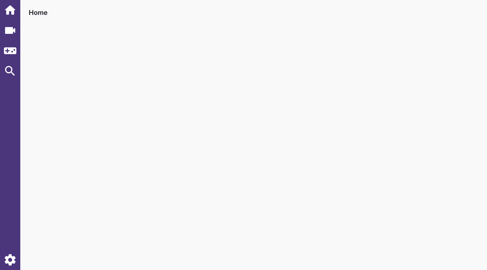

# Twitch-Player 

Unofficial Twitch stream player.

## Meta

- Code: `git clone it://github.com/unindented/twitch-player.git`
- Home: <https://unindented.github.io/twitch-player/>

## Contributors

- Daniel Perez Alvarez ([unindented@gmail.com](mailto:unindented@gmail.com))

## License

Copyright (c) 2018 Daniel Perez Alvarez ([unindented.org](https://unindented.org/)). This is free software, and may be redistributed under the terms specified in the LICENSE file.
