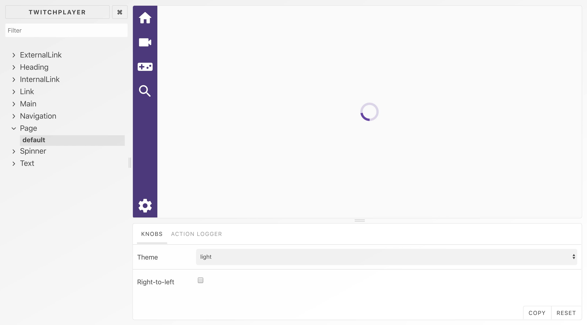

# UI Components

UI components for TwitchPlayer.



## Storybook

To render these components in Storybook, do:

```
yarn start
```

## Building

To build this package, run:

```
yarn build
```

To rebuild this package as you make changes to it, run:

```
yarn watch
```
