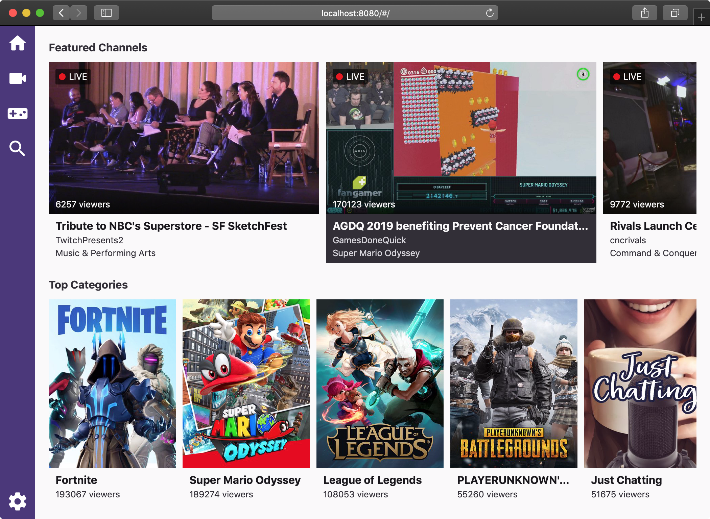

# [Web App](https://unindented.github.io/twitch-player/web/)

Web app for TwitchPlayer.



## Running

To run this project locally, do:

```
yarn start
```

## Building

To build this project for production, do:

```
yarn build
```
